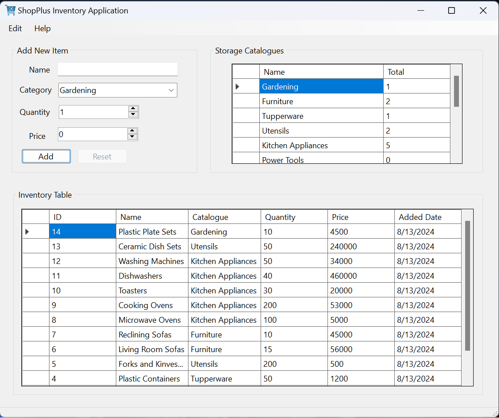

# InventoryApplication
This is an Inventory WinForms Application built in C# that stores records for incoming items kept by a store in order to keep track of how much of every item is available and it's wholesale price. The application allows you to categorize items and observe how many units of each Item Category is available. The data is stored locally in a SQLite database.
  
The start up window presents tables of registered Categories, Products and an Input Field to enter new items.
  

  
The Products Table allows you to select an Item which leads you to an Edit Window that allows you to edit and delete a selected item. Changes reflect throughout the entire application.
  
In the top left "Edit" option is a dropdown with a button that takes you to the Create Category Window that provides you with an overview of the list of registered Categories ready to edited along with an Entry Field.
  

  
A selected and already registered Category fills the Entry Field Indicating that it's readiness for changes. And a click on the then activated "Edit" button places the Category in a special Edit Window where specific changes can be made, as shown below with the example 'Kitchen Utensils'.
  

  
"Save Changes" simply saves the renamed Category. "Reset Products" allows you to reset all the registered items that sit under the Category without deleting the Category itself. And "Delete" allows you to delete both the Category and its registered Products from the database.

